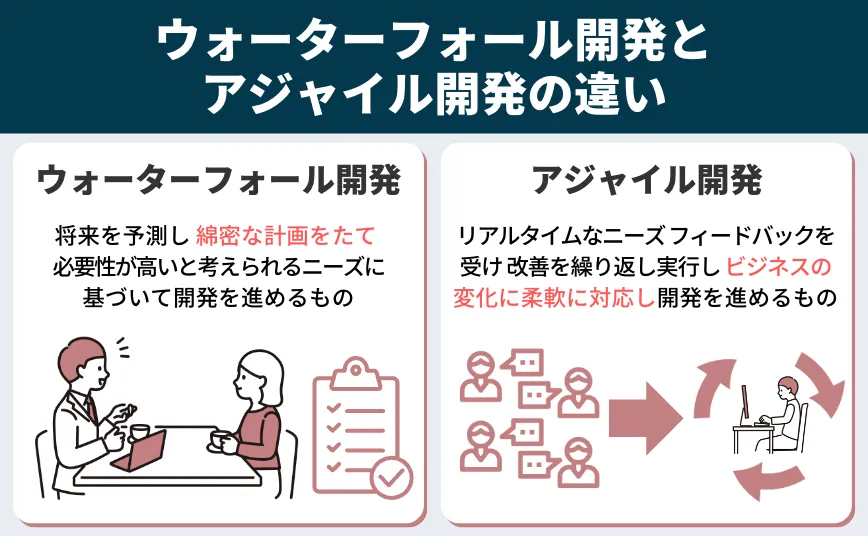

# ウォーターフォール

### ウォーターフォールは、ソフトウェア開発の手法で、段階的かつ直線的な進行を特徴とします。要件定義、設計、開発、テスト、展開の各フェーズが順番に進み、一度進んだフェーズに戻ることはありません。

## メリット

- **直線的な進行**: 開発プロセスは段階的に進み、一度に 1 つの段階が完了すると次の段階に進みます。
- **文書化と計画**: 各段階で詳細な文書が作成され、要件定義、設計、開発、テストの各段階が明確に定義されます。

## デメリット

- **変更が困難**: 一度段階が進むと、変更が困難になる傾向があります。後の段階での変更はコストが高くつくことがあります。

## 種類

1. クラシックウォーターフォール
1. 改良型ウォーターフォール
1. 反復型ウォーターフォール
1. スパイラルモデル

## 比較

### ウォーターフォールは段階的な計画と文書化を重視するのに対し、アジャイルは柔軟性と顧客との継続的なコラボレーションを重視しています。

